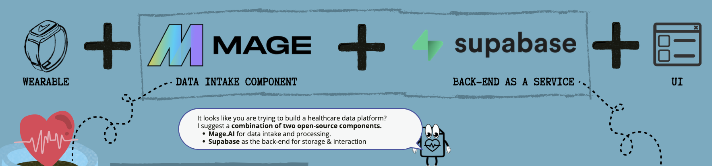

# mHealth data platform prototype created using pre-exisisting open-source components.



This is a prototype build to support my paper an test the proposed architectural design.
The prototype includes a handful of demo pipelines inside the data intake component, some data inside the back-end as a service component and a lowcode UI (testing ease of extensability).

## Running the prototype
After cloning the repo locally and opening the root folder.
Execute the following commands:
```bash 
cd prototype_combined
docker compose -f back_end_component.yml -f data_intake_component.yml -f lowcode_UI_example.yml up -d
```
To stop the docker compose stack run the following command:
```bash
docker compose -f back_end_component.yml -f data_intake_component.yml -f lowcode_UI_example.yml down
```

### Accessing the different parts
* The back-end (Supabase) at: http://localhost:8000
* The data intake / pipeline builder (Mage.AI) at: http://localhost:6789
* The lowcode demo UI (Budibase) at: http://localhost:10000

### Login information for dashboards and components:

| Budibase    |  |
|----------|-----------------|
| email    | stresswearables |
| password | stresswearables |

| Supabase    |  |
|----------|-----------------|
| email    | supabase |
| password | supabase |

Mage.AI requires no login in this prototype.

## Links to components
* https://supabase.com/
* https://www.mage.ai/
* https://budibase.com/ !!Lowcode tool (demo only) React or other Javascript framework recommended when adding a UI!!
